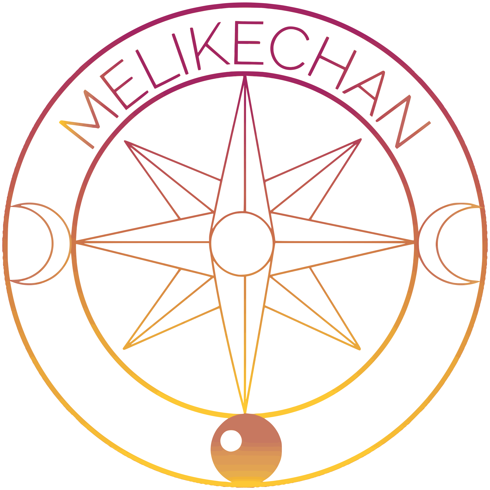

  
  <h1> Melike Vurucu | melikechan </h1>

Hey there, this is Melike from Turkey!

I am _interested in quantum computing, artificial intelligence, and mathematics_. In addition, I am an artist/graphic designer.

I _mainly_ work in **deep learning** and want to work in **quantum computing** in the **future**. 

I'm interested in **system/low-latency programming and optimization-related stuff** too, but I don't _think_ of a career in it. _(for now)_.

  
<i>Some legacy information</i>

  
  I _used to_ do **competitive programming** as **a hobby** but I _don't do_ it anymore.
  

You can look at **my pins** for the **projects worth showing**! 

## Skills

### Current technologies that I use frequently

#### Programming Languages

#### Deep learning & data science libraries

#### Build systems

### Technologies/programming languages with which I have familiarity/experience with

Web development

**NOTE: I wouldn't say I like doing webdev and don't consider this field a career. I just do web dev when _I have to_.**

**In the future:**

### Technologies I want to learn in the future

Programming languages

Deep Learning

Quantum computing

### Current development tools/IDE's/platforms/API's

## Other platforms

## Github statistics

